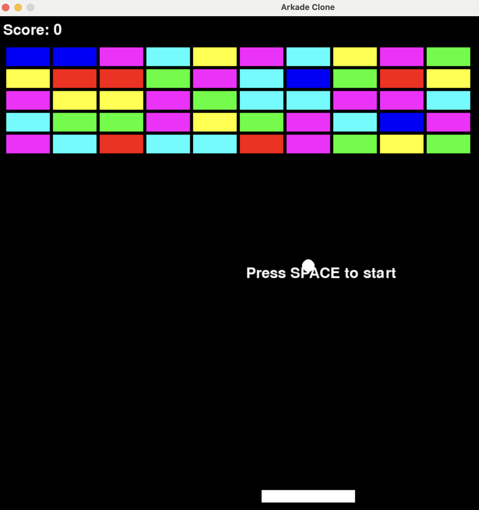

# 🎮 RetroGamesWithPyGame

A collection of five classic retro games built with Python and Pygame. Each game is a self-contained script reproducing the mechanics of a beloved arcade or console title.



---

## Table of Contents

- [Overview](#overview)
- [Requirements](#requirements)
- [Installation](#installation)
- [Project Structure](#project-structure)
- [Games](#games)
  - [Arkade (Breakout Clone)](#1-arkade--breakout-clone)
  - [Pac-Man](#2-pac-man)
  - [Ping Pong](#3-ping-pong)
  - [Snake](#4-snake)
  - [Super Mario](#5-super-mario)
  - [Tetris](#6-tetris)
- [Controls Reference](#controls-reference)
- [Architecture Notes](#architecture-notes)
- [Known Limitations & Potential Improvements](#known-limitations--potential-improvements)
- [License](#license)

---

## Overview

This project demonstrates how to implement core game-development concepts — collision detection, physics, sprite management, game state machines, and frame-rate control — using [Pygame](https://www.pygame.org/), the Python wrapper around SDL2. Each game is intentionally kept minimal and readable, making the codebase well-suited for learning purposes.

| Game | File | Window Size | Players |
|------|------|-------------|---------|
| Arkade (Breakout) | `arkade.py` | 1000 × 800 | 1 |
| Pac-Man | `pacman.py` | 800 × 600 | 1 |
| Ping Pong | `pingpong.py` | 800 × 600 | 2 |
| Snake | `snake.py` | 800 × 600 | 1 |
| Super Mario | `supermario.py` | 800 × 600 | 1 |
| Tetris | `tetris.py` | 480 × 600 | 1 |

---

## Requirements

- Python 3.8+
- Pygame 2.x

```bash
pip install pygame
```

Tested with Pygame 2.5.2 (released September 18, 2023).

---

## Installation

```bash
# Clone or download the repository
git clone https://github.com/<your-username>/RetroGamesWithPyGame.git
cd RetroGamesWithPyGame

# Install dependency
pip install pygame

# Run any game
python arkade.py
python pacman.py
python pingpong.py
python snake.py
python supermario.py
python tetris.py
```

---

## Project Structure

```
RetroGamesWithPyGame-master/
├── arkade.py         # Breakout / Arkanoid clone
├── pacman.py         # Pac-Man clone
├── pingpong.py       # Two-player Pong clone
├── snake.py          # Snake clone (Italian variable names)
├── supermario.py     # Platformer inspired by Super Mario
├── tetris.py         # Tetris clone with full piece rotation
├── arkade.png        # Arcade cabinet screenshot / hero image
└── Readme.md         # Original readme
```

---

## Games

### 1. Arkade — Breakout Clone

**File:** `arkade.py`  
**Window:** 1000 × 800 px

#### Gameplay

Control a paddle at the bottom of the screen to bounce a ball into a grid of 50 coloured blocks (5 rows × 10 columns). Clear all blocks to win. You have 3 lives.

#### State Machine

The game uses a simple string-based state machine:

| State | Description |
|-------|-------------|
| `"start"` | Waiting screen — press SPACE to begin |
| `"play"` | Active gameplay |
| `"game_over"` | All lives lost |
| `"win"` | All blocks cleared |

#### Key Mechanics

- **Angle control**: The horizontal speed of the ball is adjusted based on where it hits the paddle (centre hit = straight, edge hit = steep angle), capped at ±8 px/frame.
- **Block grid**: Generated by `create_blocks()`, each block is a `pygame.Rect` paired with a random colour from six options.
- **Ball reset**: On life loss the ball resets to screen centre with a random horizontal direction.

#### Controls

| Key | Action |
|-----|--------|
| `←` / `→` Arrow Keys | Move paddle |
| `SPACE` | Start / restart game |

---

### 2. Pac-Man

**File:** `pacman.py`  
**Window:** 800 × 600 px

#### Gameplay

Guide Pac-Man (yellow circle) around the screen eating 20 randomly placed dots while avoiding a single pursuing ghost (blue circle). The game ends immediately on ghost collision.

#### Key Mechanics

- **Ghost AI**: The ghost moves step-by-step towards Pac-Man along both X and Y axes each frame — a simple axis-aligned chase with no pathfinding.
- **Dot collection**: Euclidean distance collision detection between Pac-Man and each dot; collecting a dot awards 10 points.
- **Boundary clamping**: Pac-Man is clamped to window edges; the ghost is not clamped and can theoretically exit if the player avoids it long enough.

#### Controls

| Key | Action |
|-----|--------|
| Arrow Keys | Move Pac-Man |

> **Note:** There are no maze walls in this implementation. It is an open-field simplified variant.

---

### 3. Ping Pong

**File:** `pingpong.py`  
**Window:** 800 × 600 px

#### Gameplay

A two-player Pong game. Each player controls a paddle. The ball bounces off top/bottom walls and paddles; a point is scored when the ball exits the left or right edge.

#### Architecture

This is the most object-oriented game in the collection, with two dedicated classes:

**`Paddle`**
- Holds a `pygame.Rect` for position and collision.
- `move(dy)` shifts the paddle vertically and clamps it within screen bounds.

**`Ball`**
- Initialised at screen centre with a randomised direction.
- `move()` updates position; returns `True` if the ball exits left or right (scoring event).
- `__init__()` is re-called directly to reset the ball after scoring (unconventional but functional).

#### Controls

| Key | Player | Action |
|-----|--------|--------|
| `W` | Left (Player 1) | Move paddle up |
| `S` | Left (Player 1) | Move paddle down |
| `↑` | Right (Player 2) | Move paddle up |
| `↓` | Right (Player 2) | Move paddle down |

---

### 4. Snake

**File:** `snake.py`  
**Window:** 800 × 600 px

> ℹ️ Variable names and comments are written in **Italian** (e.g., `serpente` = snake, `mela` = apple, `schermo` = screen).

#### Gameplay

Classic Snake: guide the snake to eat apples (red squares), growing by one block each time. The game ends if the snake collides with itself. The snake **wraps around** screen edges rather than dying on boundary contact.

#### Key Mechanics

- **Grid movement**: Movement is discrete — the snake moves one `DIMENSIONE_BLOCCO` (20 px) block per tick at 6 FPS.
- **Wrap-around**: If the snake exits any edge, it reappears on the opposite side.
- **Self-collision**: Checked by comparing every body segment to the current head position. Collision triggers `game_over = True`.
- **Growth**: Eating an apple increments `lunghezza_serpente`; the body list is trimmed to this length each frame.

#### Controls

| Key | Action |
|-----|--------|
| Arrow Keys | Change direction |

---

### 5. Super Mario

**File:** `supermario.py`  
**Window:** 800 × 600 px

#### Gameplay

A side-scrolling-style platformer. Jump across 8 platforms of varying heights, collect yellow coins, and avoid red enemies. There is no score tracking or win condition in the current implementation.

#### Architecture

Three classes manage the game entities:

**`Player`**
- Holds a `pygame.Rect` and vertical velocity `velocity_y`.
- Applies gravity (`GRAVITY = 0.5`) each frame when not on the ground.
- Jumping sets `velocity_y = -JUMP_STRENGTH` (−10 px/frame).
- Ground and platform collision sets `on_ground = True` and zeroes velocity.

**`Enemy`**
- Bounces horizontally between screen edges at 3 px/frame.
- Initial direction is randomised.

**`Coin`**
- Static collectible (collision detection not yet implemented).

#### Controls

| Key | Action |
|-----|--------|
| `←` / `→` Arrow Keys | Move left / right |
| `SPACE` | Jump (when on ground) |

> **Note:** Coin collection and enemy collision detection are not yet implemented — these are good candidates for contribution.

---

### 6. Tetris

**File:** `tetris.py`  
**Window:** 480 × 600 px (10 × 20 grid of 30 px blocks, with side panel)

#### Gameplay

Standard Tetris rules: falling tetrominoes must be arranged to complete horizontal lines, which are then cleared. The fall speed increases every 5 seconds. The game ends when a new piece cannot be placed at the top of the grid.

#### Architecture

**`Tetromino` class**
- Holds `x`, `y`, `shape` (2D list), `color`, and `rotation`.
- `rotate()` performs a 90° clockwise rotation using Python's `zip(*shape[::-1])` transpose trick.

**Key functions**

| Function | Purpose |
|----------|---------|
| `create_grid(locked_positions)` | Rebuilds the full 20×10 grid each frame from the dictionary of locked cells |
| `draw_grid(surface, grid)` | Renders cells and grid lines |
| `draw_tetromino(surface, tetromino)` | Renders the active falling piece |
| `valid_move(tetromino, grid)` | Checks bounds and collision with locked cells |
| `clear_rows(grid, locked)` | Detects and removes complete rows, shifts remaining rows down |

**Scoring:** 10 points per row cleared.  
**Difficulty:** `fall_speed` starts at 0.5 s/tick and decreases by 0.005 every 5 seconds (minimum 0.15 s).

#### All 7 Tetrominoes

| Shape | Colour |
|-------|--------|
| I (1×4) | Cyan |
| O (2×2) | Yellow |
| T | Magenta |
| S | Red |
| Z | Green |
| J | Blue |
| L | Orange |

#### Controls

| Key | Action |
|-----|--------|
| `←` | Move piece left |
| `→` | Move piece right |
| `↓` | Soft drop (accelerate fall) |
| `↑` | Rotate piece clockwise |

---

## Controls Reference

| Game | Move | Action |
|------|------|--------|
| Arkade | `←` `→` | Paddle; `SPACE` = start/restart |
| Pac-Man | Arrow Keys | Move Pac-Man |
| Ping Pong | `W`/`S` (P1), `↑`/`↓` (P2) | Move paddles |
| Snake | Arrow Keys | Change direction |
| Super Mario | `←` `→`, `SPACE` | Move, jump |
| Tetris | `←` `→` `↓` `↑` | Move, soft drop, rotate |

---

## Architecture Notes

All games share the same structural pattern:

1. **Initialisation** — `pygame.init()`, window setup, constant definitions.
2. **Game loop** — `while True` / `while running`:
   - **Event handling** — `pygame.event.get()` for quit and key events.
   - **Update** — physics, AI, collision detection, state transitions.
   - **Draw** — clear screen, render objects, `pygame.display.flip()`.
   - **Timing** — `clock.tick(60)` to cap at 60 FPS (Snake uses 6 FPS for its grid-step movement).
3. **Exit** — `pygame.quit()` and `sys.exit()`.

Ping Pong and Tetris use OOP (classes). The remaining games are procedural with module-level globals, which is appropriate for their simplicity.

---

## Known Limitations & Potential Improvements

| Game | Limitation | Suggested Improvement |
|------|------------|----------------------|
| Pac-Man | No maze, single ghost, game ends abruptly | Add maze walls, multiple ghosts, power pellets, death screen |
| Snake | No restart after game over | Add restart prompt and high-score tracking |
| Super Mario | Coins uncollectable, no enemy collision, no scrolling | Implement coin collection, enemy-kill mechanic, horizontal camera scroll |
| Ping Pong | Ball resets via direct `__init__()` call | Extract a `reset()` method; add a serve delay |
| Tetris | No "next piece" preview panel rendered | Render `next_piece` in the existing side panel area |
| All | No sound effects or music | Add `pygame.mixer` for SFX and background tracks |
| All | No persistent high scores | Persist scores to a JSON or SQLite file |

---

## License

Pygame is distributed under the **GNU Lesser General Public License (LGPL)**, allowing both open-source and commercial use. This project's game scripts carry no explicit license; consult the original repository for terms.

---

*Generated documentation for [RetroGamesWithPyGame](https://github.com/RetroGamesWithPyGame-master).*
